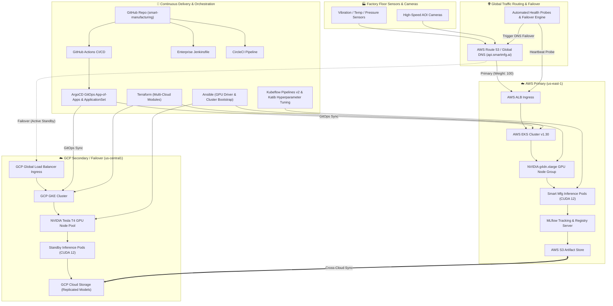

# 🏭 Smart Manufacturing MLOps Platform

[](https://github.com/KishorKumarParoi/smart-manufacturing/actions/workflows/ci.yaml)
[](https://github.com/KishorKumarParoi/smart-manufacturing/actions/workflows/cd-gitops.yaml)
[](https://github.com/KishorKumarParoi/smart-manufacturing/actions/workflows/failover-drill.yaml)
[](https://kubernetes.io/)
[](https://developer.nvidia.com/cuda-toolkit)
[](https://argoproj.github.io/cd/)
[](https://www.terraform.io/)
[](https://mlflow.org/)

An enterprise-grade, end-to-end MLOps platform engineered for high-throughput smart manufacturing assembly lines. Provides real-time industrial sensor anomaly detection, automated optical defect inspection (AOI), GPU acceleration, multi-engine CI/CD pipelines (GitHub Actions, Jenkins, CircleCI), GitOps continuous delivery via ArgoCD, Infrastructure-as-Code via Terraform, configuration management via Ansible, and an active **Multi-Cloud (AWS + GCP) Multi-Region Failover Architecture** with a single one-click deploy command.

---

## 🏛️ Architecture Overview



---

## ⚡ Key Technical Capabilities

| Capability | Technologies | Purpose |
| :--- | :--- | :--- |
| **Edge & Cloud Inference** | PyTorch, CUDA 12.1, FastAPI, Uvicorn | Sub-10ms anomaly detection and optical inspection inference on GPUs |
| **Model Tracking & Registry** | MLflow, S3 / GCS, SQLite/PostgreSQL | Experiment tracking, model versioning, staging/production stage gates |
| **Training Orchestration** | Kubeflow Pipelines v2, Katib | Automated distributed GPU training, hyperparameter Bayesian optimization |
| **Continuous Integration** | GitHub Actions, Jenkins, CircleCI | Multi-pipeline linting, unit tests, GPU container builds, Trivy security audit |
| **GitOps Continuous Delivery** | ArgoCD (ApplicationSet + Root App) | Declarative sync across multi-cloud Kubernetes clusters with auto-healing |
| **Infrastructure as Code** | Terraform (Modular) | Provisions AWS EKS, GCP GKE, VPCs, GPU node pools, and Route 53 DNS |
| **Configuration Management** | Ansible | Automates NVIDIA Container Toolkit, CUDA drivers, Helm operators |
| **GPU Acceleration** | NVIDIA GPU Operator, DCGM Exporter | GPU resource scheduling (`nvidia.com/gpu: 1`), custom metrics HPA |
| **Multi-Cloud Disaster Recovery**| Route 53 Health Checks, Active Prober | Zero-downtime failover from AWS `us-east-1` to GCP `us-central1` |
| **One-Click Deployment** | `deploy.sh` & `Makefile` | Fully automated script to bootstrap infra, config, GitOps, and models |

---

## 🚀 One-Click Deploy Command

To execute the complete end-to-end deployment (Prerequisite Validation ➔ Terraform Multi-Cloud Infra ➔ Ansible GPU Setup ➔ ArgoCD GitOps Sync ➔ Model Training ➔ Failover Verification):

```bash
# Run one-click deployment
./deploy.sh --all

# Or via Makefile
make deploy
```

### Granular CLI Flags
```bash
./deploy.sh --infra         # Provision AWS EKS & GCP GKE clusters via Terraform
./deploy.sh --ansible       # Bootstrap GPU drivers & Kubernetes operators
./deploy.sh --apps          # Deploy ArgoCD GitOps applications & K8s overlays
./deploy.sh --train         # Run GPU training pipelines and log to MLflow
./deploy.sh --failover-test # Execute multi-cloud automated failover drill
```

---

## 💻 Local Quickstart (Docker Compose)

You can run the entire multi-cloud simulation locally on your workstation without cloud costs:

```bash
# 1. Start simulated environment (MinIO S3, MLflow, AWS API, GCP API, Failover Daemon)
make compose-up

# 2. Check service health
curl -s http://localhost:8000/health | jq .
curl -s http://localhost:8001/health | jq .

# 3. Test sensor anomaly inference
curl -X POST http://localhost:8000/predict/sensor \
  -H "Content-Type: application/json" \
  -d '{
    "machine_id": "CNC-SPINDLE-01",
    "readings": [
      {"vibration_x": 0.45, "vibration_y": 0.40, "vibration_z": 0.30, "temperature_c": 64.5, "pressure_bar": 120.1, "spindle_rpm": 3005.0, "acoustic_emission_db": 45.2},
      {"vibration_x": 3.80, "vibration_y": 2.90, "vibration_z": 1.50, "temperature_c": 110.0, "pressure_bar": 70.0, "spindle_rpm": 2400.0, "acoustic_emission_db": 85.0}
    ]
  }' | jq .

# 4. View MLflow UI
open http://localhost:5000

# 5. Run automated failover drill
make failover-drill

# 6. Tear down local environment
make compose-down
```

---

## 🔄 Multi-Cloud Failover Runbook

1. **Continuous Health Probing:** The failover monitor (`src/failover/health_probe.py`) queries the primary AWS endpoint (`/health`) every 5 seconds.
2. **Outage Detection:** If the primary cluster returns 3 consecutive failures (HTTP 5xx, timeout, or degraded node status), the probe triggers an automated failover.
3. **Route 53 / Global DNS Switch:** DNS records for `api.smartmfg.ai` switch immediately to the warm standby GCP GKE cluster in `us-central1`.
4. **Model Synchronization:** Cross-cloud weights are kept in sync continuously via `scripts/sync_models_crosscloud.sh`.
5. **Auto-Failback:** Once the AWS primary cluster recovers and passes health checks, traffic safely migrates back to the primary cluster.

---

## 🧪 Testing & Quality Gates

Run the test suite with coverage:
```bash
make test
```

Compile Kubeflow Pipelines:
```bash
make compile-kubeflow
```

---

## 📄 License
MIT License. Maintained by [Kishor Kumar Paroi](https://github.com/KishorKumarParoi).
